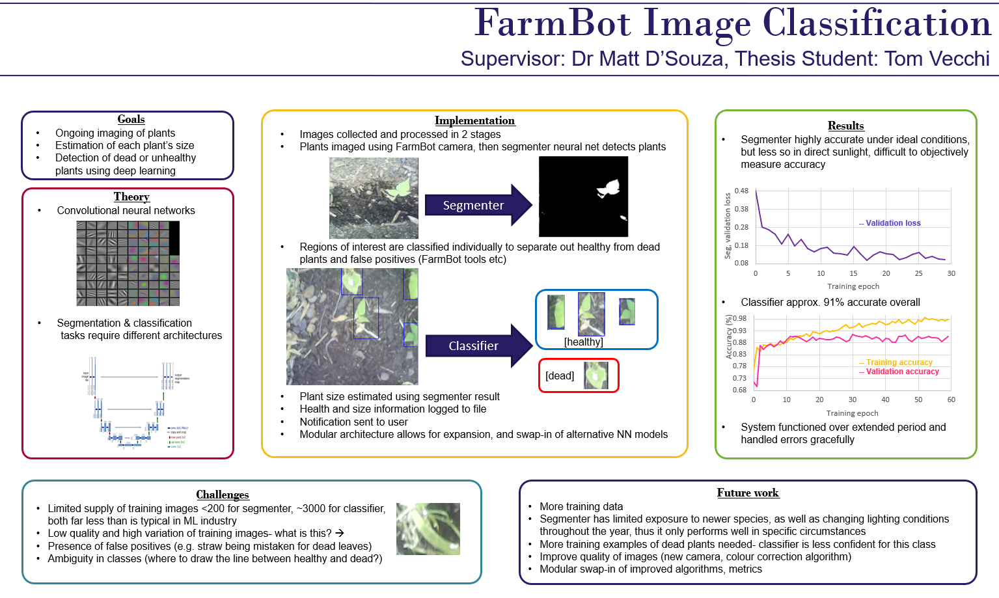
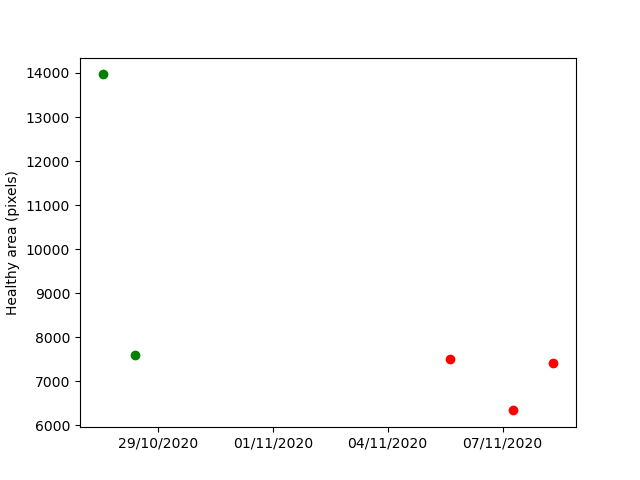

# FarmBot Image Classification Thesis
# By Tom Vecchi, 2020

Uses deep learning techniques to annotate and analyse images collected from the FarmBot, enabling time-series analysis to be performed on the data and underperforming plants to be identified.

## Setup instructions

The FarmBot user credentials and the email account which will be used for sending results must be entered in the creds.py file.\
Additionally the trained models, classifier_model.h5 and segmenter_model.h5, must be present in the ./models folder. The trained models are not included in this repo since Github doesn't allow files larger than 25 MB. To get around this I have provided Google Drive links to the trained models below. To use them, download both models and place them in the ./models folder, without changing the names. \
[Segmenter](https://drive.google.com/file/d/1ox4OqL_2divMJK28_X8HSiR6UxDvZOjJ/view?usp=sharing) \
[Classifier](https://drive.google.com/file/d/1LqovRvpe-H53koUIMzPJBP1ovmSMSI1S/view?usp=sharing) \
The plant_locations.txt file contains a list of plants to image in the format type,x,y. \

## Usage

Run daily_routine.py. It will image all the plants in plant_locations.txt and perform the analysis on them, then log this information in .log files in the logs folder. Use visualiser.py [filename] to plot the data in a given log file. An example of the visualised output is shown below.

 \
 \
For ongoing operations, uncomment the exit(0) statement at line 128 in daily_routine.py. This will allow the program to continually capture more data at 24-hour intervals.

### How it works

The code communicates with the FarmBot over MQTT and downloads the images using a HTTP REST API. The analysis uses a two-step approach of semantic segmentation using a U-Net algorithm, followed by a modified AlexNet for classifying healthy and dead plants. 

### Acknowledgements

This thesis would not have been possible without the help of my thesis supervisor Dr Matt D'Souza, and thesis tutor Scott Thomason.
